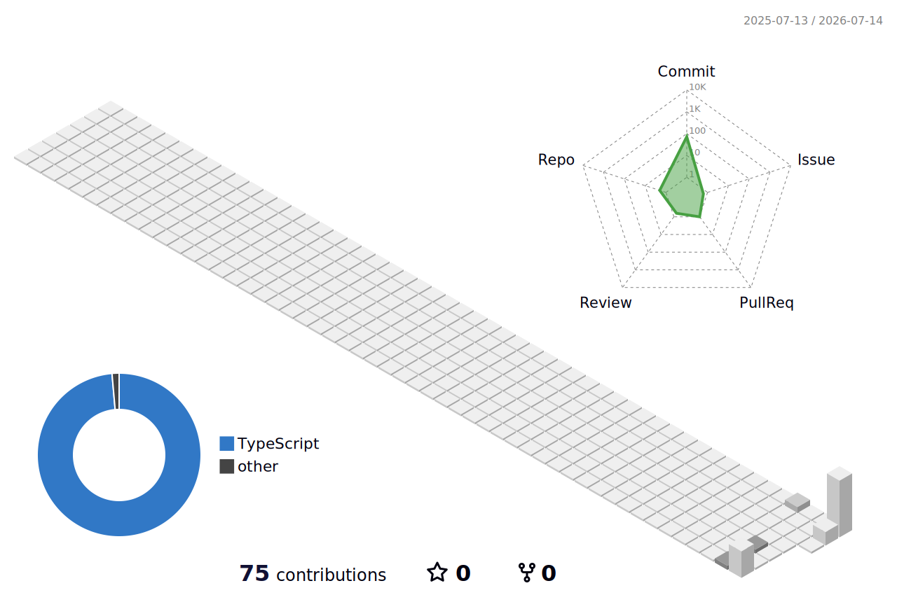

<h3 align="center">🌸 Sobre mí &nbsp;|&nbsp; About me 🌸</h3>

¡Hola! Soy **Dámaris**, de Villa María, Córdoba (Argentina) 🇦🇷, con raíces en Tarragona, Cataluña 🇪🇸. Estudiante avanzada de **Ingeniería en Sistemas de Información** (UTN FRVM, 85% cursado) y de **Contador Público** (UNVM, 70% cursado) — un perfil híbrido entre la tecnología y las finanzas. Hoy trabajo automatizando procesos con IA y herramientas low-code, doy clases de Automatización en una Diplomatura de Inteligencia Artificial, y gestiono programas de posgrado. Me apasiona transformar procesos manuales en soluciones simples: bases de datos, automatizaciones y dashboards que devuelven horas de trabajo.

*Hi! I'm **Dámaris**, from Villa María, Córdoba (Argentina) 🇦🇷, with roots in Tarragona, Catalonia 🇪🇸. Advanced student of **Information Systems Engineering** (UTN FRVM, 85% complete) and **Public Accounting** (UNVM, 70% complete) — a hybrid profile between technology and finance. I currently build AI-powered process automations, teach Automation in an AI postgraduate program, and manage postgraduate programs. I love turning manual processes into simple solutions: databases, automations, and dashboards that give hours back.*

 

<h3 align="center">💼 Experiencia destacada &nbsp;|&nbsp; Highlighted experience</h3>

| Rol / Role | Organización / Organization | Impacto / Impact |
|:--|:--|:--|
| 🤖 Analista de Automatización de Procesos (IA)  *Process Automation Analyst (AI)* | Consultora Paula Toselli | 80% de consultas resueltas automáticamente con agentes de IA  *80% of queries auto-resolved by AI agents* |
| 🎓 Docente · Diplomatura en Inteligencia Artificial  *Instructor · AI Postgraduate Program* | Universidad Nacional de Villa María | 100% de aprobación en +40 PyMEs capacitadas  *100% pass rate across 40+ SMEs trained* |
| 📊 Referente de Diplomaturas  *Postgraduate Programs Lead* | UTN FRVM | -40% en tiempo de procesamiento con Notion  *-40% enrollment processing time using Notion* |

 

<h3 align="center">🎓 Formación &nbsp;|&nbsp; Education</h3>

🖥️ **Ingeniería en Sistemas de Información** — UTN FRVM · 85% avance · esperado Dic. 2026  
*Information Systems Engineering — 85% complete · expected Dec. 2026*

💼 **Contador Público** — UNVM · 70% avance · esperado Jul. 2027  
*Public Accounting — 70% complete · expected Jul. 2027*

 

<h3 align="center">✨ Stack &amp; herramientas &nbsp;|&nbsp; Stack &amp; tools</h3>

 
 

  

 

<h3 align="center">🌌 Calendario de contribuciones 3D &nbsp;|&nbsp; 3D contribution calendar</h3>

<picture>
  <source media="(prefers-color-scheme: dark)" srcset="./profile-3d-contrib/profile-night-rainbow.svg" />
  <source media="(prefers-color-scheme: light)" srcset="./profile-3d-contrib/profile-south-season-animate.svg" />
  
</picture>

 

<h3 align="center">🐍 Snake de contribuciones &nbsp;|&nbsp; Contribution snake</h3>

<picture>
  <source media="(prefers-color-scheme: dark)" srcset="https://raw.githubusercontent.com/damaris412/damaris412/output/github-contribution-grid-snake-dark.svg" />
  <source media="(prefers-color-scheme: light)" srcset="https://raw.githubusercontent.com/damaris412/damaris412/output/github-contribution-grid-snake-pastel.svg" />
  
</picture>

 

<h3 align="center">📈 GitHub Stats</h3>

 

💬 *Trabajo en equipo, organización y aprendizaje continuo — con foco en resolver problemas reales.*  
*Teamwork, organization and continuous learning — focused on solving real problems.*

  

